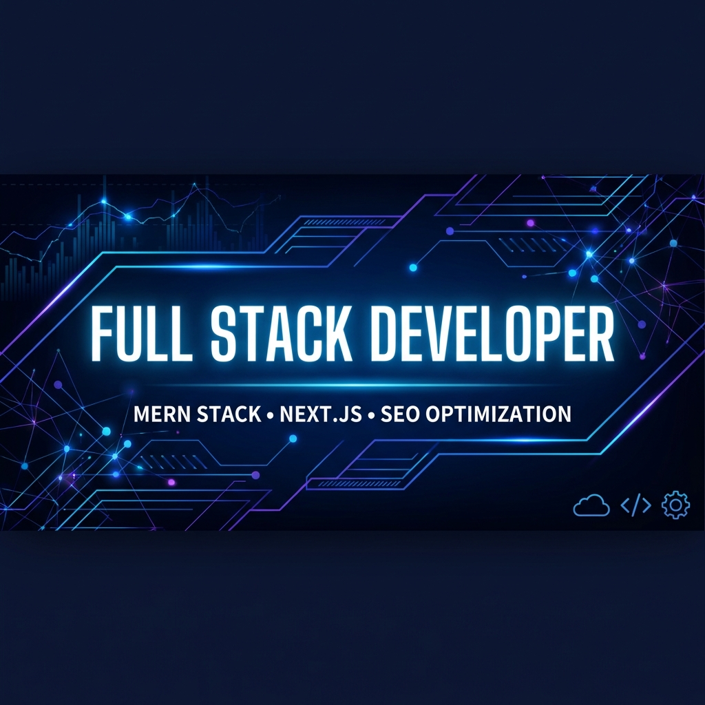

  

# 👋 Hello, I'm Soumya Roy (skr-c0der)

### 🚀 Full Stack Developer | MERN Stack & Next.js Expert | SEO Specialist

I am a passionate Full Stack Developer focused on building high-performance, scalable, and SEO-friendly web applications. With expertise in the **MERN** stack and **Next.js**, I bridge the gap between complex backend logic and sleek, interactive frontend experiences.

---

### 🛠️ Tech Stack & Skills

#### **Frontend Ecosystem**

  
  
  
  
  

#### **Backend & Database**

  
  
  
  
  

#### **DevOps & Tools**

  
  
  
  

---

### 📊 GitHub Stats

  
   
  

---

### 📫 Connect with Me
- **LinkedIn**: [Soumya Roy](https://www.linkedin.com/in/connectsoumyaroy/)
- **Portfolio**: [Click to view my portfolio](https://connectsoumyaroy.github.io/) (Placeholder - Update if needed)
- **Email**: [skr.c0der@gmail.com](mailto:skr.c0der@gmail.com)

---

  <i>"Building the future of the web, one commit at a time."</i>

